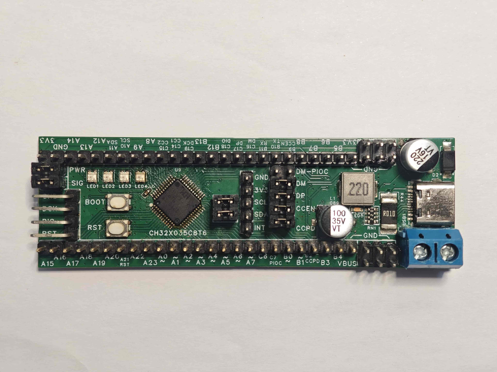
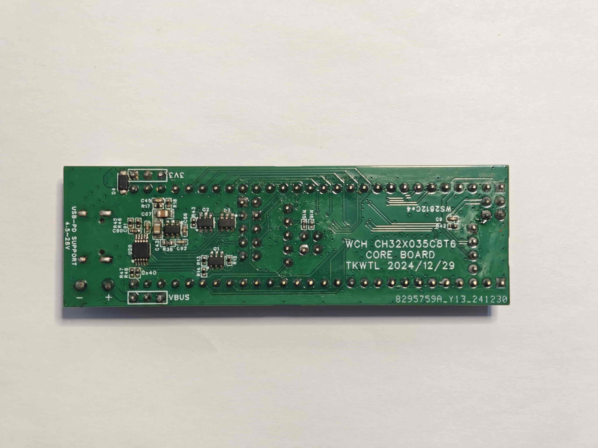
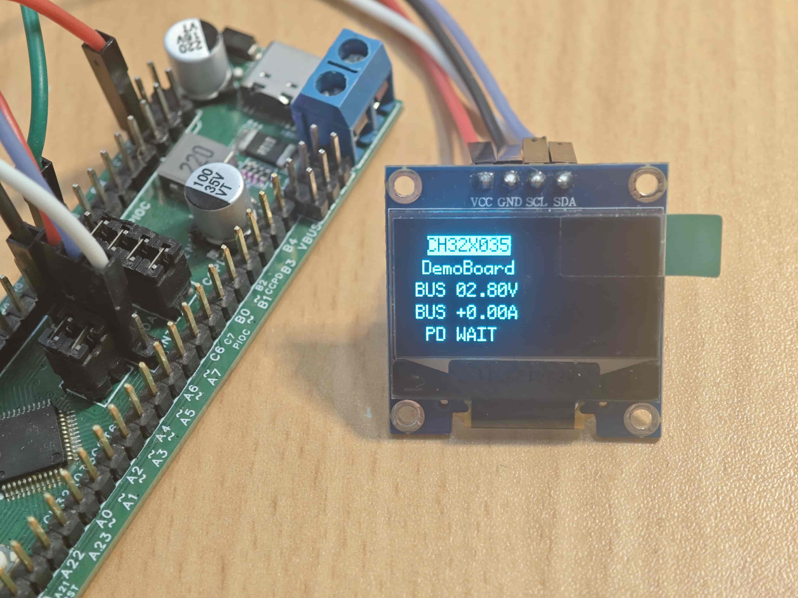
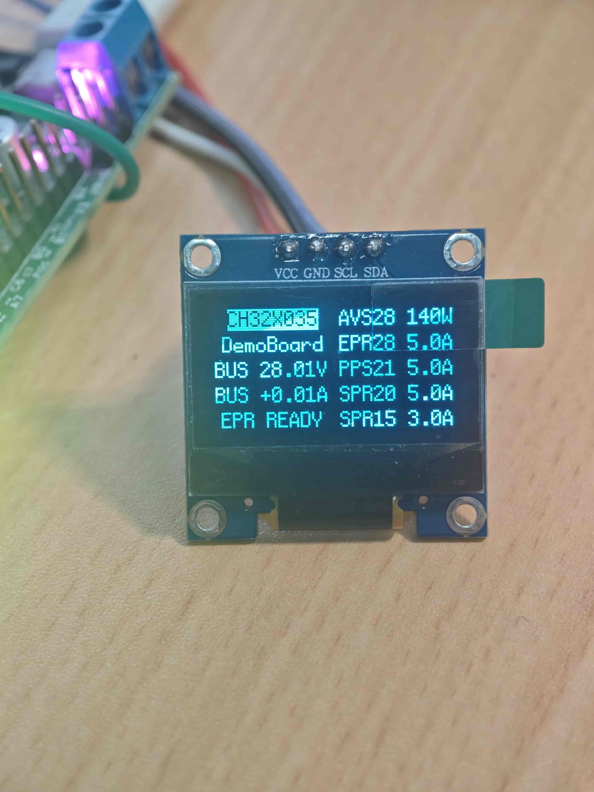
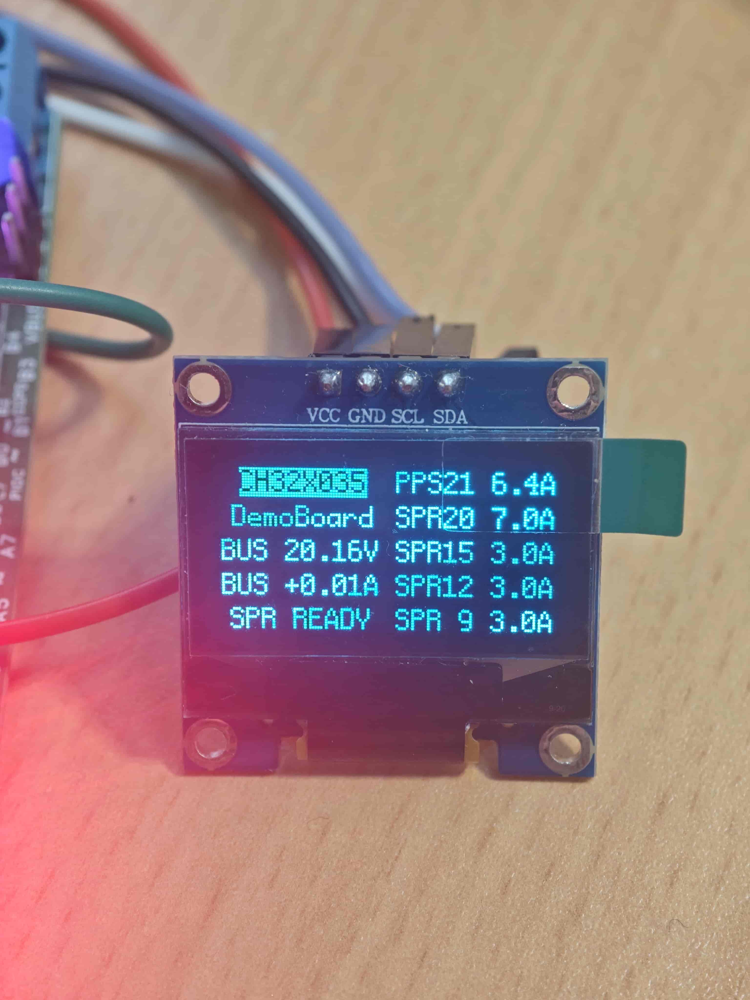

# CH32X035 USB-PD EPR 开发板

本项目是一块主要用于 **CH32X035** 开发与评估的定制板卡，以 **CH32X035C8T6**（LQFP48）为基准设计：围绕 USB 与 USB-PD 两条主线，板载完整的 USB 通信、USB-PD / Type-C 通信链路、可选 CC 下拉（Rd）网络、USBPD 降压电源与接口保护，PD 输入**最大支持 28 V（PD 3.1 EPR）**；同时配有 4 颗 WS2812（验证 PIOC）、INA226 与 OLED 插座（验证 I2C）以及两线调试接口，并将其余可用引脚引出，用于验证 CH32X035 的片上外设。

## 板载资源

- **主控**：CH32X035C8T6 —— 青稞 RISC-V4C 核，最高 48 MHz，62 KB Flash / 20 KB SRAM。
- **USB 通信**：Type-C 接口的 D+/D- 接入 MCU 内置 USB 2.0 全速控制器及 PHY，可做 USB Device / Host 实验。
- **USB-PD 通信**：CC1/CC2（PC14/PC15）经板载 PD 前端接入 USBPD PHY，固件实现 Sink 受电应用；**最大支持 28 V PD 电压**（EPR 固定电压挡）。
- **可选下拉**：CC 上的 5.1 kΩ Rd 网络可选择接入/断开，由 `#CCPD`（PB2，低有效）控制，方便在纯 USB 实验与 PD Sink 实验之间切换形态。
- **USBPD 降压电源**：将协商得到的 VBUS（最高 28 V）降压为整板系统电源；全板由 PD 源供电，无需额外电源即可运行。
- **接口保护**：VBUS、CC、USB 数据线均带接口保护电路，提升热插拔与异常供电源场景下的可靠性。
- **WS2812 ×4**：由 PIOC IO0 → PC7 驱动，用于验证 PIOC 可编程协议 I/O 控制器。
- **INA226 + OLED 插座（I2C 测试）**：I2C1（PA10/PA11）挂载 INA226 电压/电流监测（10 mΩ 分流），并提供插座用于接入**经典 SSD1306 0.96'' 128×64 单色 OLED 模块（带板 I2C 版本）**，固件自动探测 0x3C/0x3D 地址。
- **两线调试接口**：SDI（SWDIO / SWCLK），配合 WCH-LinkE 完成调试与下载。
- **其它引出**：剩余可用 GPIO 与电源、地通过排针/焊盘引出，便于二次开发。
- **PD 前端控制**：PB9 `CCEN`（连通 CC 通道）、PB2 `#CCPD`（接通 Rd）。

## CH32X035 核心特性（摘自 WCH 数据手册）

1. RISC-V4C 处理器，最高 48 MHz；
2. 支持单周期乘法和硬件除法；
3. 20 KB SRAM、62 KB Flash；
4. 系统供电范围：2～5.5 V；
5. 多种低功耗模式：睡眠 / 停止 / 待机；
6. 上/下电复位、可编程电压监测器；
7. 8 路通用 DMA 控制器；
8. 可编程协议 I/O 控制器 PIOC；
9. 2 组运放 OPA/PGA、3 组模拟电压比较器 CMP；
10. 多路外部 12 位 ADC 转换通道；
11. 14 路 TouchKey 通道检测；
12. 2 个 16 位高级定时器、1 个 16 位通用定时器；
13. 2 个看门狗定时器（独立和窗口）、1 个系统时基定时器；
14. 4 组 USART（支持 LIN / ISO7816）、1 个 I2C（支持 SMBus/PMBus）、1 个 SPI；
15. USB 2.0 全速控制器及 PHY；
16. USB PD 与 Type-C 控制器及 PHY；
17. 快速 GPIO 端口，支持 24 个外部中断；
18. 96 位芯片唯一 ID；
19. 串行 2 线调试接口 SDI；
20. 封装形式：LQFP64M、LQFP48、QFN28、QSOP28、QFN20、TSSOP20 等。

## 起步与部署

### 1. 获取文件

克隆或下载本仓库（已包含固件源码、MRS 工程、硬件文件与文档）：

```bash
git clone https://github.com/TKWTL/CH32X035_DemoBoard.git
```

也可以直接在 GitHub 页面使用 **Code → Download ZIP**。

### 2. 工具下载

**软件工具**

| 工具 | 用途 | 备注 |
| --- | --- | --- |
| [MounRiver Studio II（MRS2）](https://www.mounriver.com/) | 打开/构建工程、下载与调试（内置 RISC-V GCC） | 必装 |
| WCHISPTool | 经 USB 内置引导下载固件 | 可选：MRS2 已内置该下载功能，也可在 WCH 官网单独下载 |
| 串口终端软件（任意串口助手 / MobaXterm 等） | 观察 921600 调试日志 | 可选 |

**下载/调试硬件工具（可选）**

| 硬件 | 用途 | 备注 |
| --- | --- | --- |
| WCH-LinkE | 两线 SDI 调试与下载，带串口透传 | 推荐使用，见下节 |
| USB-TTL 模块（CH340 / CH343 / CP2102 等） | 串口日志（替代 WCH-LinkE 的串口透传） | 可用别的芯片/模块代替 |

### 3. 调试器选择：WCH-LinkE（非必需）

- **推荐**：**WCH-LinkE** 支持本芯片的两线 SDI 调试与下载，并可透传一路串口，是最方便的选择；**注意不要购买/使用普通（老款）WCH-Link**，其并不能直接用于 CH32X035。
- **没有 WCH-LinkE 也可以正常开发**：
  - 串口日志可以用别的芯片代替——任意 USB-TTL（CH340、CH343、CP2102 等）接 PB10/PB11/GND 即可；
  - 固件下载可以走 USB：通过板载 USB 口进入芯片内置引导，用 **WCHISPTool** 完成烧录。

### 4. 硬件文件获取与打样、配单、焊接

1. **硬件文件获取**：从 `Hardware/` 获取——`source/` 设计源工程、`Preview/` 原理图 / PCB 预览与网表、`Manufacturing/` Gerber、BOM、贴片坐标（详见 `Hardware/README.md`）；
2. **打样**：按需选择 **二层版** 或 **四层版** Gerber 包，解压后（含钻孔文件）打包给板厂（嘉立创、捷配等）生产；
3. **配单**：按 `Manufacturing/BOM/BOM_CH32X035_DemoBoard.csv` 采购物料（CH32X035C8T6、Type-C 母座、PD 前端与降压电源元件、INA226、WS2812、OLED 插座等），注意封装与方向；
4. **焊接**：建议先完成电源部分并验证，再焊主控与外设；Type-C 与芯片注意方向；上电前先用万用表确认无短路，再接入 PD 源。

焊接完成后的板卡实物（正面 / 背面）：





### 5. 构建与烧录

1. 用 MRS2 打开 `Firmware/CH32X035_DemoBoard.wvproj`，执行 `Clean Project` → `Build Project`；
2. 烧录方式二选一：
   - **WCH-LinkE**：接好两线调试口后直接在 MRS2 中下载；
   - **USB + WCHISPTool**：无需调试器，经芯片内置引导下载（进入方式见 WCH 官方说明）；
3. 首次烧录请在烧录工具中把 **PA21 配置为 RST**（本固件不做 Option Byte 编程，详见 `Firmware/README.md`）。

### 6. 串口连接

- 波特率 921600，8N1；PB10 为 MCU 发送、PB11 为 MCU 接收（板上丝印 RX/TX 是网络名，方向相反）；
- 接线：PB10 → USB-TTL RXD，PB11 → USB-TTL TXD，GND 共地。

## 调试

### 启动与协商流程

复位后 MCU 由 PD 源默认 5 V 供电启动，固件依次完成：启动横幅与复位原因打印 → USART1 / I2C1 / INA226 / SSD1306 探测 / WS2812 初始化 → `PD WAIT` 等待 CC 接入 → SPR 协商（示例 20 V/5 A）→ EPR 进入并请求 28 V/5 A → 375 ms 周期 KeepAlive → PD 稳定后点亮 WS2812 并显示仪表盘。

未接入 Source 时，OLED 显示 `PD WAIT`；接入后状态依次为 `NEGOTIATE` → `SPR READY` / `EPR READY`：



### 参考串口日志（联想 C140，请求最高挡位）

```text
=== CH32X035 custom dev-board demo / coroOS ===
[RESET] cause: POR/PDR PIN SW
SystemClk:48000000 Hz
ChipID:03510611
UART1: PB10 TX / PB11 RX @ 921600, DMA async, TX/RX 256B
[BOARD] PD Sink front-end enabled
[I2C] I2C1 PA10/PA11 @ 400kHz, DMA1 CH6 TX / CH7 RX; async clients scheduled
[WS2812] ready: PIOC IO0 -> PC7, 4 LEDs; held off until PD power stable
[PD] Sink started; SPR <= 20000 mV, EPR target 28000 mV / max 5000 mA
[PD] EPR Sink Operational PDP=140 W; status=PD WAIT, waiting for CC attach

[INA226] detected async: MFR=0x5449 DIE=0x2260, I2C=400kHz DMA RX/TX
CC2 SRC Connect
[SSD1306] online at 0x3c; 5+5 slot PDO dashboard, MiaoUI h12w6 font
[PD] SPR Request PDO5: 20000 mV, 5000 mA, EPR-capable RDO

[PD] Source_Capabilities: 6 PDO(s); fixed-request policy max 20000 mV:
  PDO1 raw=0a81912c FIXED 5000 mV 3000 mA
  PDO2 raw=0002d12c FIXED 9000 mV 3000 mA
  PDO3 raw=0003c12c FIXED 12000 mV 3000 mA
  PDO4 raw=0004b12c FIXED 15000 mV 3000 mA
  PDO5 raw=000641f4 FIXED 20000 mV 5000 mA  <REQUEST>
  PDO6 raw=c9a43264 PPS_APDO 5000-21000 mV, 5000 mA (not requested)
[PD] Source advertises EPR capability; establish SPR contract first
[PD] SPR contract ready: PDO5, 20000 mV / 5000 mA
[PD] EPR Mode: sending Enter, Sink PDP=140 W
[PD] EPR Mode: Enter Acknowledged
[PD] EPR Mode: Enter Succeeded
[PD] EPR_Source_Capabilities: 9 PDO slots (36 bytes)
  PDO1 raw=0a81912c FIXED 5000 mV 3000 mA
  PDO2 raw=0002d12c FIXED 9000 mV 3000 mA
  PDO3 raw=0003c12c FIXED 12000 mV 3000 mA
  PDO4 raw=0004b12c FIXED 15000 mV 3000 mA
  PDO5 raw=000641f4 FIXED 20000 mV 5000 mA
  PDO6 raw=c9a43264 PPS 5000-21000 mV 5000 mA
  PDO7 raw=00000000 <empty>
  PDO8 raw=0008c1f4 FIXED 28000 mV 5000 mA  <EPR TARGET>
  PDO9 raw=d230968c AVS 15000-28000 mV PDP=140 W
[PD] EPR Request PDO8: 28000 mV, 5000 mA
[PD] EPR contract ready: PDO8, 28000 mV / 5000 mA
[PD] EPR KeepAlive period=375 ms
[WS2812] PD power stable; chase/fade enabled
[INA226] VBUS=28003.750 mV, VSHUNT=+70.0 uV, I=+7.00 mA
[INA226] VBUS=28007.500 mV, VSHUNT=+75.0 uV, I=+7.50 mA
[INA226] VBUS=28005.000 mV, VSHUNT=+67.5 uV, I=+6.75 mA
[INA226] VBUS=28002.500 mV, VSHUNT=+75.0 uV, I=+7.50 mA
[INA226] VBUS=28006.250 mV, VSHUNT=+70.0 uV, I=+7.00 mA
[INA226] VBUS=28008.750 mV, VSHUNT=+75.0 uV, I=+7.50 mA
[INA226] VBUS=28007.500 mV, VSHUNT=+67.5 uV, I=+6.75 mA
```

上面对应的 OLED 仪表盘（`EPR READY`；右列 PDO 按 AVS > EPR > PPS > SPR 顺序显示）：



换用另一款电源（SW3538）时的显示：协商停留在 SPR 档（`SPR READY`），右列 PDO 随 Source 能力刷新——PDO 展示与 Sink 请求策略相互独立：



### 日志解读

- `ChipID:03510611`：芯片唯一 ID；
- `CC2 SRC Connect`：适配器接在 CC2 通道；
- `PDO5 ... 20000 mV <REQUEST>`：SPR 阶段命中 20 V/5 A（EPR-capable RDO）；
- `PDO6 ... PPS (not requested)`：固件策略只请求固定 PDO，PPS/AVS 仅作显示；
- `PDO8 ... 28000 mV <EPR TARGET>`：EPR 阶段命中 28 V/5 A 固定挡；
- `EPR KeepAlive period=375 ms`：28 V 合同维护心跳；
- `INA226 VBUS=28003.750 mV`：实测 VBUS ≈ 28.0 V，整板静态电流约 7 mA；
- `[WS2812] ... chase/fade enabled`：仅在 PD 供电稳定后启用灯效，合同丢失会自动关闭。

> 更多调试记录（插拔测试、波形、故障排查等）待补充。

---


### 仓库结构

```text
CH32X035_DemoBoard/
├─ Firmware/                       可构建的 MounRiver Studio II 工程
│  ├─ APP/                         应用任务、main、中断包装、UI/灯效
│  ├─ BSP/                         板级 + INA226 + SSD1306 + WS2812 设备驱动
│  ├─ Peripheral/                  项目专用外设服务
│  │  ├─ PD/                       USB-PD Sink / EPR 策略与 CH32X035 PD 端口
│  │  ├─ I2C/                      异步 I2C1 + DMA + 恢复/看门狗
│  │  ├─ PIOC/                     WS2812 使用的 PIOC 运行时
│  │  ├─ Time/                     自由运行时间服务
│  │  └─ USART/                    USART1 DMA 异步控制台
│  ├─ ThirdParty/                  裁剪版 u8g2 兼容/字体组件
│  ├─ Project/                     底层 MCU/工具链支持
│  │  ├─ Core/                     青稞内核 + WCH 标准外设库
│  │  │  ├─ inc/
│  │  │  └─ src/
│  │  ├─ Debug/
│  │  ├─ Ld/
│  │  ├─ Scheduler/
│  │  ├─ Startup/
│  │  └─ obj/                      生成输出；已被 Git 忽略
│  ├─ .project
│  ├─ .cproject
│  ├─ CH32X035_DemoBoard.wvproj
│  └─ README.md                    固件架构与构建说明
├─ Hardware/                       硬件设计文件
│  ├─ source/                      设计源工程（EasyEDA Pro，.epro2）
│  ├─ Preview/                     原理图 / PCB PDF 与网表
│  ├─ Manufacturing/               生产文件
│  │  ├─ Gerber/                   二层版 / 四层版 Gerber 包
│  │  ├─ BOM/                      BOM（CSV）
│  │  └─ CPL/                      贴片坐标（PickAndPlace CSV）
│  └─ README.md
├─ Images/                         照片、截图与 README 插图
├─ Docs/                           设计笔记、协议笔记与发布文档
├─ .gitignore                      构建产物 / IDE 状态忽略规则
├─ LICENSE                         GNU AGPL-3.0 许可证全文
└─ README.md
```

### 文档

固件实现细节见 `Firmware/README.md`。诸如 PD 时序笔记之类的协议/调试记录保留在 `Firmware/Peripheral/PD/` 实现附近，而仓库级设计文档可归集到 `Docs/` 下。


### 状态

已验证的固件路径包括 SPR 20 V、EPR Mode 进入、EPR Source Capabilities 解析、固定 28 V / 5 A 请求、INA226 遥测、SSD1306 仪表盘与 WS2812 灯效。硬件行为仍取决于所接供电源、板卡跳线与具体板卡版本，因此发布标签应记录匹配的硬件版本与测试条件。

### 参考文档

**WCH 官方资料**

- [CH32X035 数据手册（DS0）](https://www.wch.cn/downloads/CH32X035DS0_PDF.html)
- [CH32X035 应用手册（RM）](https://www.wch.cn/downloads/CH32X035RM_PDF.html)
- [CH32X035 评估板说明与参考例程（EVT）](https://www.wch.cn/downloads/CH32X035EVT_ZIP.html)
- [MounRiver Studio（MRS）](https://www.mounriver.com/)

**主要器件数据手册（厂商官网）**

- [INA226（TI）](https://www.ti.com/product/INA226)
- [SSD1306（Solomon Systech）](https://www.solomon-systech.com/product/ssd1306/)
- [WS2812 系列（Worldsemi）](https://www.world-semi.com/)
- [LGS5148（Legend-Si 棱晶半导体）](https://www.legend-si.com/productinfo/990829.html)

> 其余通用物料（MOS、TVS、连接器等）可按 `Hardware/Manufacturing/BOM` 中的型号在立创商城等平台查询数据手册。

### AI 辅助创作说明

本项目的代码与文档在创作中大量借助 AI 辅助，并经过人工审阅、修改与实测后发布：

- **软件代码与仓库工程**（固件、构建配置、Git 与发布流程等）：主要由 **GPT** 辅助完成；
- **文档**（各 README、设计笔记与协议记录等）：主要由 **DeepSeek** 辅助完成。

AI 输出可能存在疏漏或错误，不能替代人工验证；若发现问题，欢迎通过 Issue 指正。

### 许可证

本项目以 **GNU AGPL-3.0**（GNU Affero General Public License v3.0）授权发布，许可证全文见 [LICENSE](LICENSE)；Copyright (C) 2026 TKWTL。

AGPL-3.0 是强 copyleft 许可证：如果你修改了本项目的固件或硬件设计，并通过网络向用户提供相应功能（例如将设备联网后对外提供服务），则必须向这些用户提供你所修改版本的完整对应源代码。硬件设计文件（原理图、PCB、Gerber、BOM）随仓库一并按同一许可证提供。
